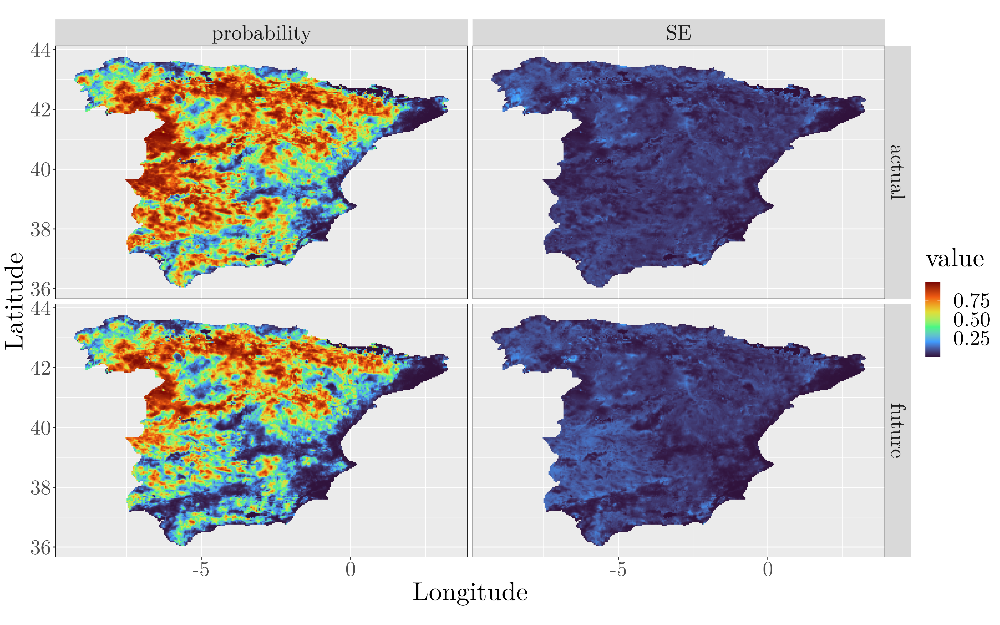

# Occupancy modelling of Black Kite

This work was part of the Quantitative conservation biogeography course at the University of Potsdam, you can see the full project report [here](Black_kite_occupancy_model_Felix_Noessler_2021.pdf) and an ODMAP-protocol [here]("ODMAP_Actual and future predicted occupancy of the Black Kite in Spain.md").

